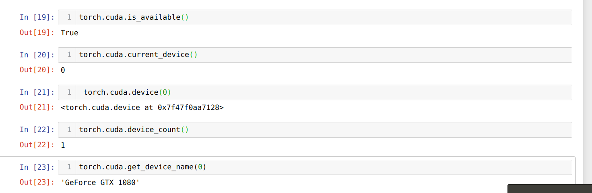

# Conda Tips 
Verify that the cv-nd environment was created in your environments: 

`conda info --envs `

Cleanup downloaded libraries (remove tarballs, zip files, etc): 

`conda clean -tp `

# Conda Environment
- [Information](https://docs.conda.io/projects/conda/en/latest/user-guide/tasks/manage-environments.html)
- Create new conda environment named myenv `conda create --name myenv python=3.7`
- To delete an environment `conda env remove --name myenv`
- You can use explicit specification files to build an identical conda environment on the same operating system platform, either on the same machine or on a different machine - `conda list --explicit > myenv_explicit.yml`
- Remove build specification from dependencies - `conda env export --no-build > myenv_no_build.yml`
- [Share conda environment across platforms.](https://stackoverflow.com/questions/39280638/how-to-share-conda-environments-across-platforms). This will only include packages that you’ve explicitly asked for, as opposed to including every package in your environment - `conda env export --from-history > myenv_from_history.yml`
- To create environment from a file - `conda create --name <env> --file <this file>`

# To use local GPU in conda 
For additional information 

[Pytorch Get Started](https://pytorch.org/get-started/locally/)

[Udacity CV-ND](https://github.com/udacity/CVND_Exercises)

[Speed Up your Algorithms Part 1 — PyTorch](https://towardsdatascience.com/speed-up-your-algorithms-part-1-pytorch-56d8a4ae7051)

[TORCH.CUDA](https://pytorch.org/docs/stable/cuda.html) 

[How to check if pytorch is using the GPU?](https://stackoverflow.com/questions/48152674/how-to-check-if-pytorch-is-using-the-gpu/48152675)


Tensor datatype from cuda to cpu 

[Differences between `torch.Tensor` and `torch.cuda.Tensor`](https://stackoverflow.com/questions/53628940/differences-between-torch-tensor-and-torch-cuda-tensor)

To see GPU udsage in terminal use ->  

`watch -n 2 nvidia-smi `

Open terminal  
```
Conda create –n cv-nd-gpu python=3.6 
Conda activate cv-nd-gpu 
conda install pytorch torchvision cudatoolkit=9.0 -c pytorch  
Git clone https://github.com/udacity/CVND_Exercises.git 
Cd CVND_Exercises 
pip install -r requirements.txt 
Jupyter-notebook
```

Inside jupypter notebook 
```
import torch 
print(torch.cuda.is_available()) 
print(torch.cuda.current_device()) 
print(torch.cuda.device(0)) 
print(torch.cuda.device_count()) 
print(torch.cuda.get_device_name(0)) 
```
Output should look like this:



# Google Colab
Read how to mount google drive and use it to hold the dataset for training using Google GPU 

[Downloading Datasets into Google Drive via Google Colab](https://towardsdatascience.com/downloading-datasets-into-google-drive-via-google-colab-bcb1b30b0166)

In google colab cell use this to mount google drive 
```
from google.colab import drive 
drive.mount('/content/gdrive') 
```